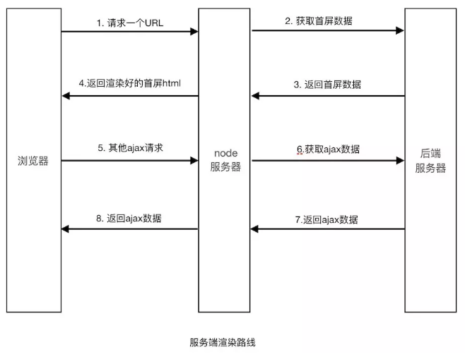
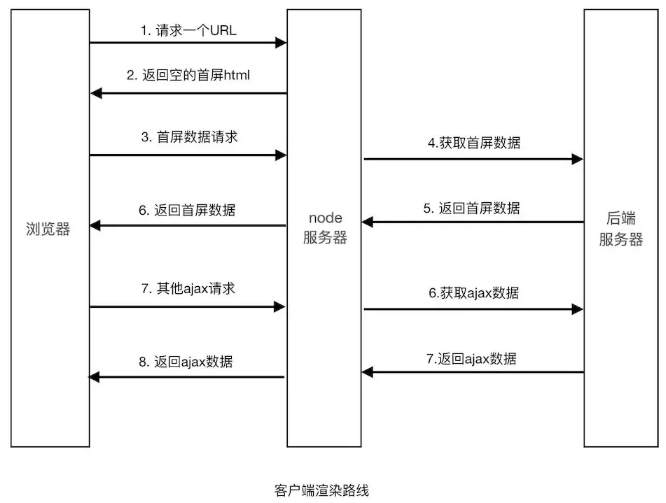

### 耗时比较：
    服务端渲染相比客户端渲染不需要等待js代码下载，加载，解析完成后再请求数据，就可以返回一个完整数据的首屏页面

### 服务端渲染优缺点：
   SSR有更利于SEO和首屏渲染，同时也有缺点：服务器压力大，开发条件受限，只会执行ComponentMount之前的生命周期，第三库使用受限，学习成本大。

### 渲染路线比较：
服务端渲染路线

客户端渲染路线

参考文献：
1. https://www.cnblogs.com/chengxs/p/11046599.html